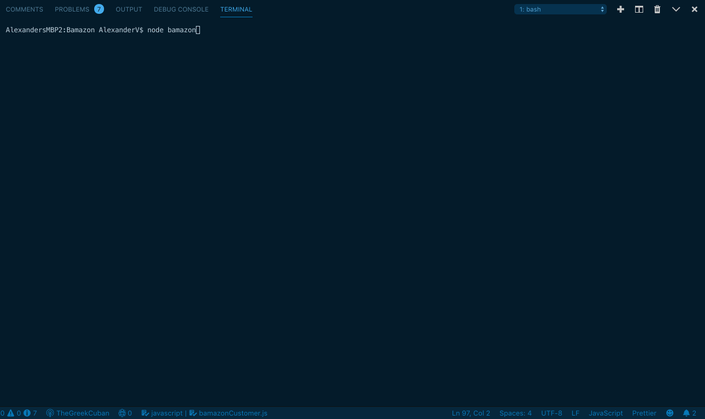
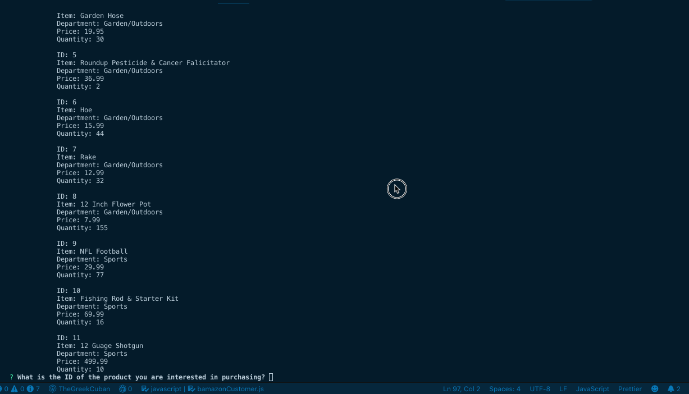
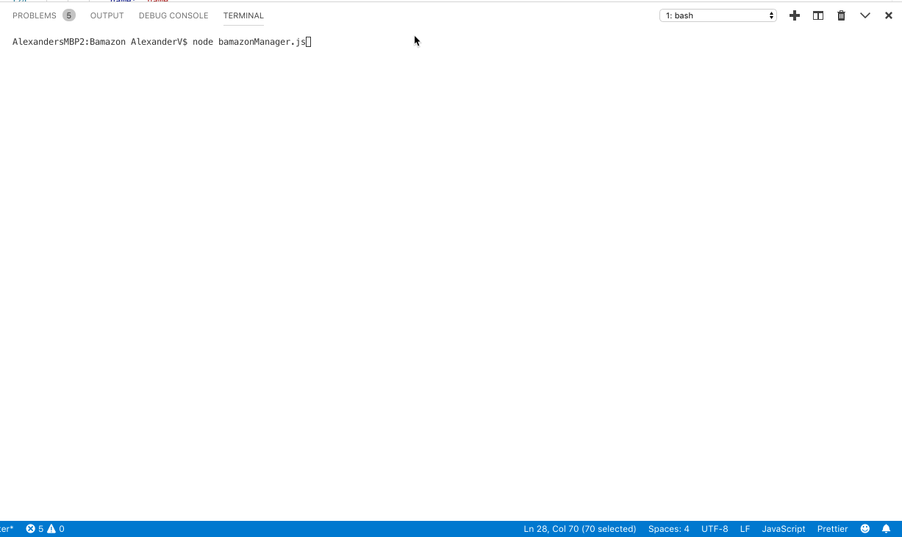
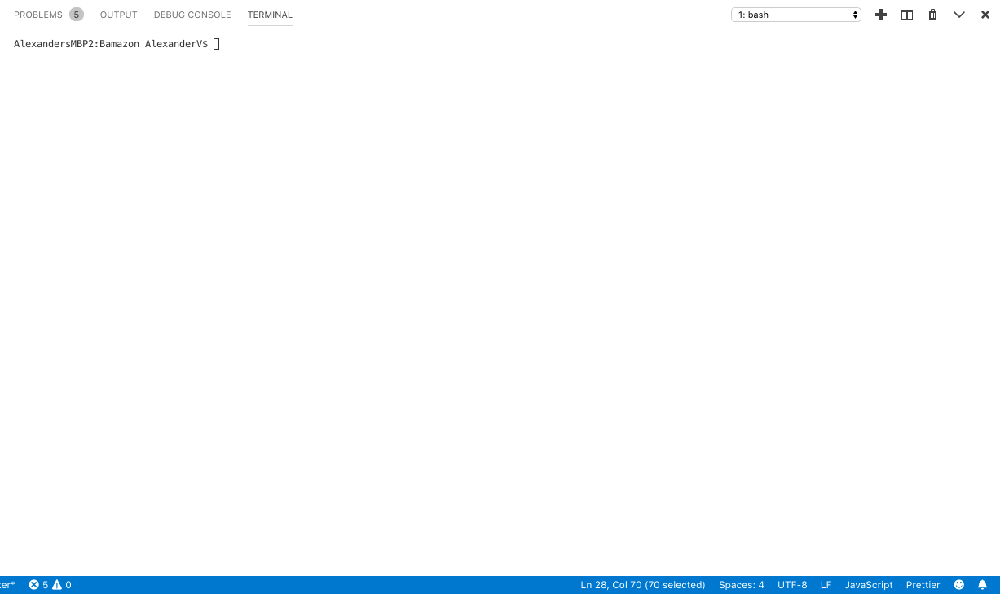
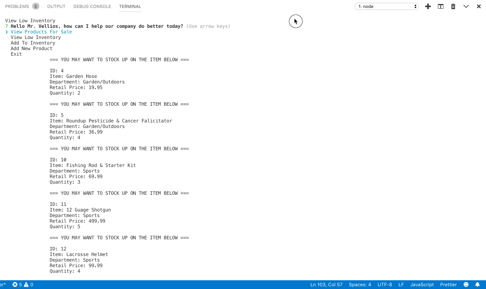
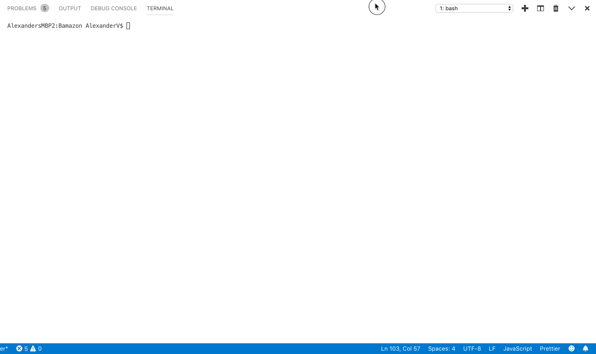
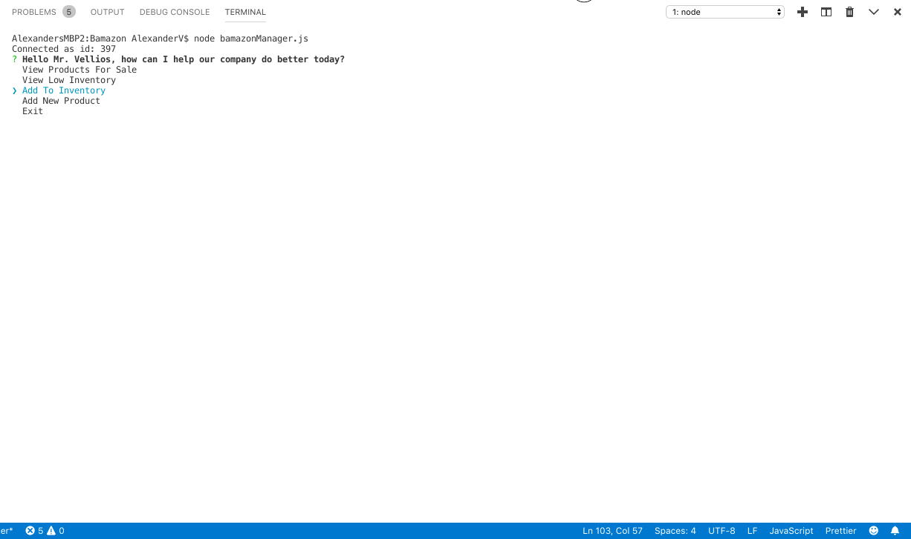
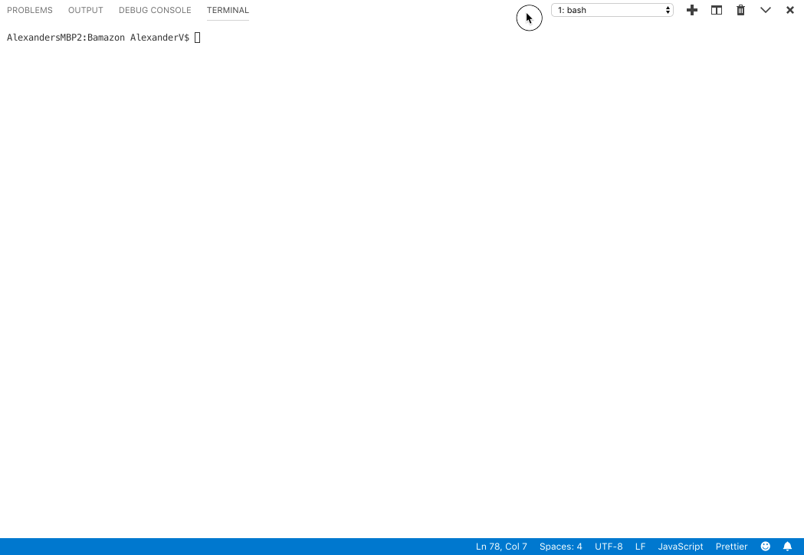

##### This is a backend application, to install it locally run the command: git clone git@github.com:TheGreekCuban/Bamazon.git
##### Once cloned, cd into the root directory and run npm install to install all the necessary packages

##### There are three levels of access in this application: Customer Mode, Manager Mode and Supervisor Mode. The inquirer prompts are initiated by running node (name of file) in the command line. Once the file is run, npm inquirer will prompt the user with questions/actions. 

## CUSTOMER MODE
##### The BamazonCustomer.js is a node.js application that makes queries to a the bamazon.sql database. The bamazon.sql database has various items with their name, quantity, department name and price. 

##### After displaying the store catalogue (bamazon.sql database), the bamazonCustomer node.js application prompts the user to input the id of the item they wish to purchase followed by the amount. With that input the application checks if there is enough inventory to fulfill the order. 

##### If there is, the application adjusts the stock_quantity and prints the oder total for the user. If there is not, it tells the user to edit their order. 

##### Order Total & Editing Of Inventory (bamazonCustomer.js)

##### Insufficient Quantity (bamazonCustomer.js)

## MANAGER MODE
##### The BamazonManager.js is a node.js application that makes queries to a the bamazon.sql database. The bamazon.sql database has various items with their name, quantity, department name and price. Unlike the bamazonCustomer.js file, this application gives the user access to information that would be typically desired by management and not for the eyes of the employee. 

##### The app begins by using the inquirer prompt to greet the manager and ask him/her what they would like to do. The manager can see the entire inventory, similar to the customer. In addition, there is an option to see inventory that has less than 6 units in stock. Next, the manager is able to use that information to order more units of the items needed. Lastly, the manager has the ability to add a completely new item to the catalogue which will update the database accordingly.

##### Query All Items (bamazonManager.js)

##### Query Low Inventory Items (bamazonCustomer.js)

##### Order More Units (bamazonCustomer.js)

##### The Inventory Was Updated!

##### Add A New Item To The Catalogue (bamazonCustomer.js)

## SUPERVISOR MODE

##### The BamazonSupervisor.js is a node.js application that makes queries to a the bamazon.sql database. In this application we have added a new table named departments and changed the products table to have a product sales column.

##### In the BamazonSupervisor.js application there are two options that npm inquirer prompts the supervisor with. The first allows the user to print the dynamically joined table that has the columns department name, product name, overhead costs, total sales and total profits. The total profits column is dynamically calculated each time a customer makes a sale.

##### The second function is the add department function which allows the supervisor to add a department to the departments table. When these departments have no products within them, the values on the dynamically created table show up as null.

###### Full demonstration of printing the departments table, adding a department and showing the updated version.

